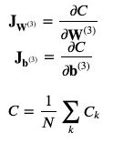
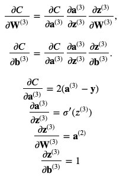
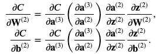
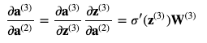
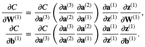
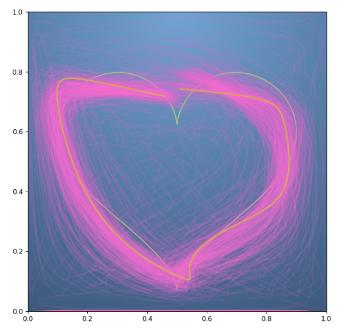

# Backpropagation

## Summary
In this Programming Assignment: Backpropagation on Coursera's Mathematics for Machine Learning: MultiVariate (Imperial College London), I trained a neural network to draw a curve. The curve takes one input variable, the amount travelled along the curve from 0 to 1, and returns 2 outputs, the 2D coordinates of the position of points on the curve.

## Processes
- Using Numpy matrices, I implemented a backpropagation Jacobians with a 3 layer neutral net. 

- Wrote algorthim for layer 3, 2, 1 of Jacobian for the cost fuction / weight partial derivatives.

- Tested my results through tracing 50,000 iterations using plot_training from the matplotlib class.

## Technologies Used
* Python
* Numpy
* Matplotlib Pyplot
* Jupyter Notebook

## Result:

